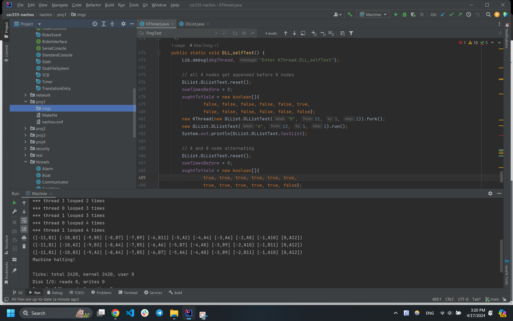

# Project 1
Name: Khai Dong

### Part 1

The source code for the interleaving is in `KThread.DLL_selfTest`.




### Part 2.1 (Invalid Data)

This interleaving is in `KThread.DLL_selfTest2`. Initially, `testList` contains 2 nodes `(1, 1)` and `(6, 6)`.

<table>
<tr>
<th> Thread 1: testList.insert(3, 3) </th>
<th> Thread 2: testList.insert(4, 4) </th>
</tr>
<tr>
<td>

```java
++ this.size; // increment size counter
DLLElement newElem = 
        new DLLElement(item, sortKey);
if(this.first == null){
    this.first = this.last = newElem;
    return;
}
DLLElement curElem = this.first;
while(curElem != null 
        && curElem.key <= sortKey)
    curElem = curElem.next;


if(curElem == null){
    this.last.next = newElem;
    newElem.prev = this.last;
    this.last = newElem;
} else {
    newElem.prev = curElem.prev;
    newElem.next = curElem;
    curElem.prev = newElem;
    if (newElem.prev == null) 
        this.first = newElem;
    else newElem.prev.next = newElem;
}
```
</td>
<td>

```java


++ this.size; // increment size counter
DLLElement newElem = 
        new DLLElement(item, sortKey);
if(this.first == null){
    this.first = this.last = newElem;
    return;
}
DLLElement curElem = this.first;
while(curElem != null 
        && curElem.key <= sortKey)
    curElem = curElem.next;

if(curElem == null){
    this.last.next = newElem;
    newElem.prev = this.last;
    this.last = newElem;
} else {
    newElem.prev = curElem.prev;
    newElem.next = curElem;
    curElem.prev = newElem;
    if (newElem.prev == null) 
        this.first = newElem;
    else newElem.prev.next = newElem;
}


```

</td>
</tr>
</table>

In Thread 1, after the while loop, `curElem` will be the node `(6, 6)`. Then, a context switch happens, Threads 2 starts
and finishes. Here, since Thread 1 has made no change to `testList`, so after Thread 2 (inserting `(4, 4)` into the list), 
the list will become 
```
(1, 1), (4, 4), (6, 6)
```
Context switching back to Thread 1, since `curElem` is still the node `(6, 6)`, `(3, 3)` is inserted just before `(6, 6)`,
yielding the final list:
```
(1, 1), (4, 4), (3, 3), (6, 6)
```
This is invalid data since the list supposed to be sorted by sortKey.


### Part 2.1 (Null Pointer Exception)

This interleaving is in `KThread.DLL_selfTest3`. Initially, `testList` contains a single node `(1, 1)`.

<table>
<tr>
<th> Thread 1: testList.prepend(0) </th>
<th> Thread 2: testList.removeHead() </th>
</tr>
<tr>
<td>

```java
int key = 0;
if (this.first != null){
    
    

    
    
    
    
    
    
    
    
    
    key = this.first.key - 1;
}
this.insert(item, key);
```
</td>
<td>

```java


if(this.first == null) {
    return null;
}
Object returnData = this.first.data;
-- this.size; // decrement the size
this.first = this.first.next; // update new head
if(this.first == null) { // if pop the last element
    this.last = null;
} else {
    this.first.prev = null;
}
return returnData;


```
</tr>
</table>

Since `testList` initially is not empty, Thread 1 will do the if branch. We do a context switch just after Thread 1 done
evaluating `this.first != null`. Then, we do the entirety of `testList.removeHead()`. Since the Thread 1 has not made any
change to `testList`, `testList` will end up empty with `testList.first` become `null`. Then, when Thread 1 tries to access
`this.first.key` (equivalent to `null.key`), it will result in a `NullPointerException`.