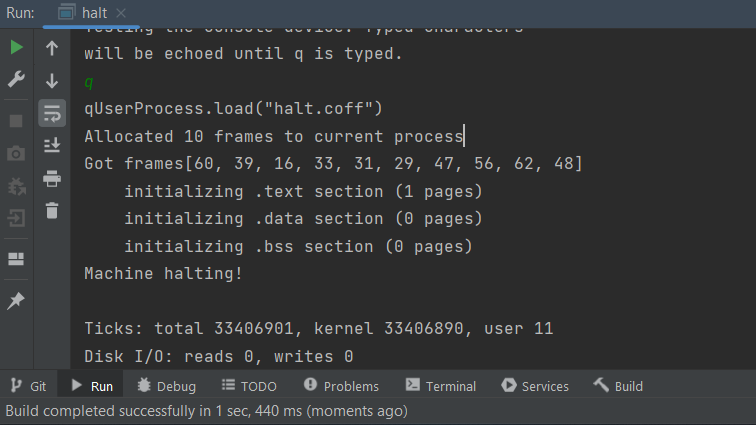
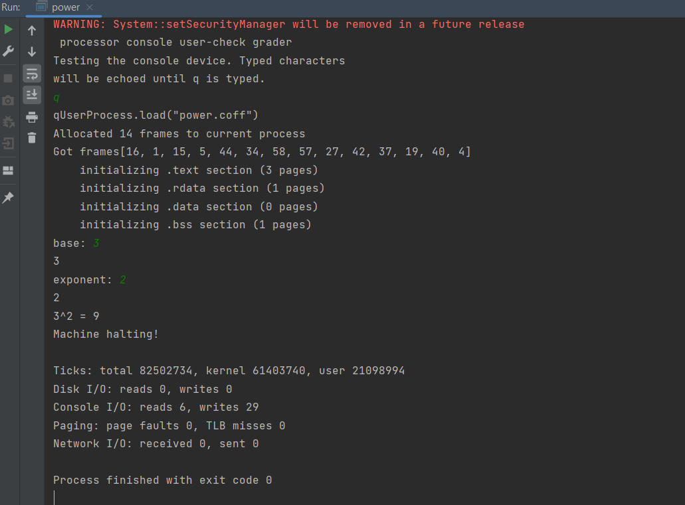
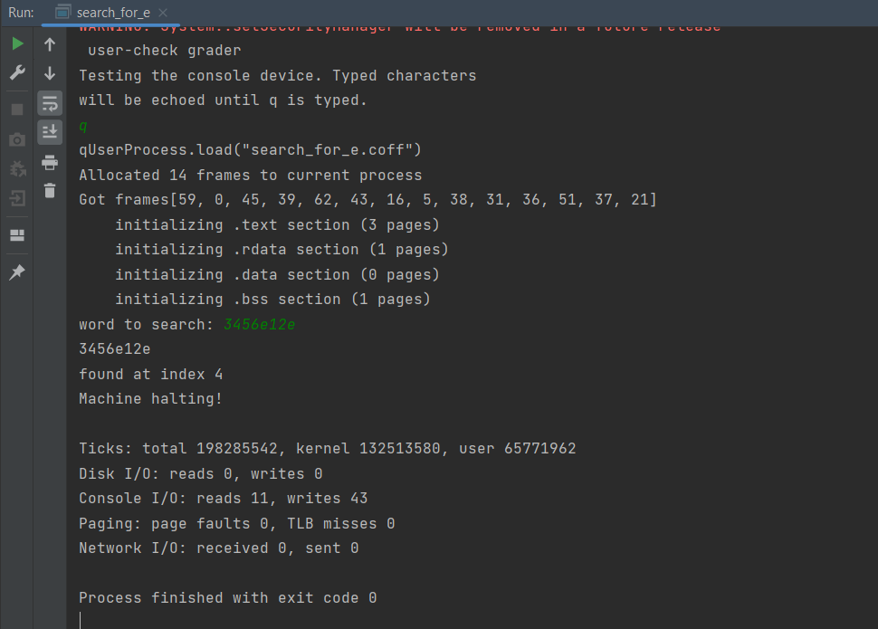
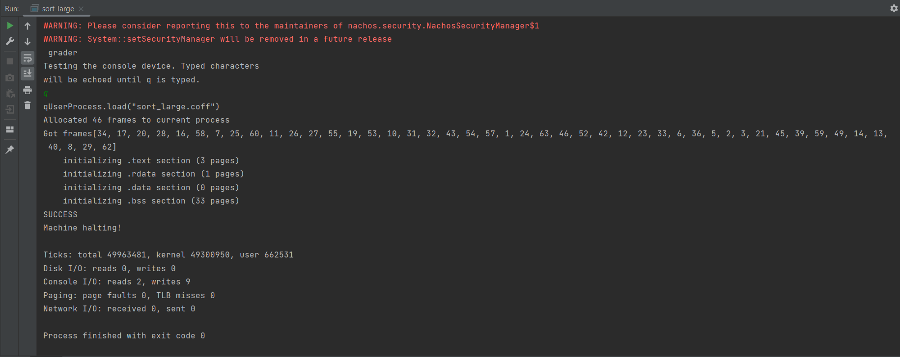
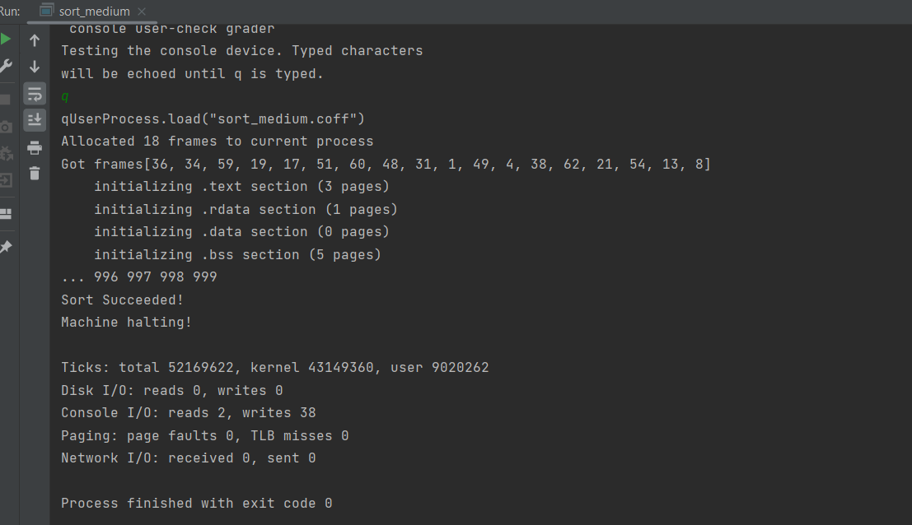
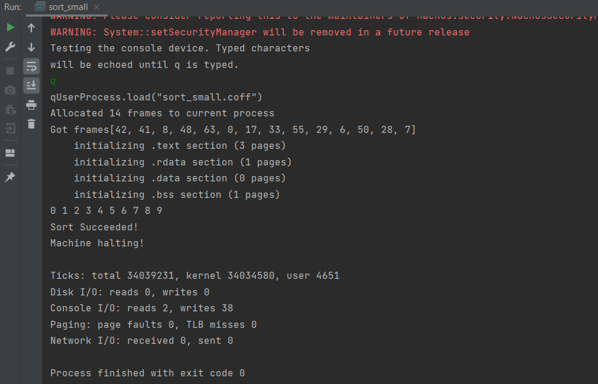
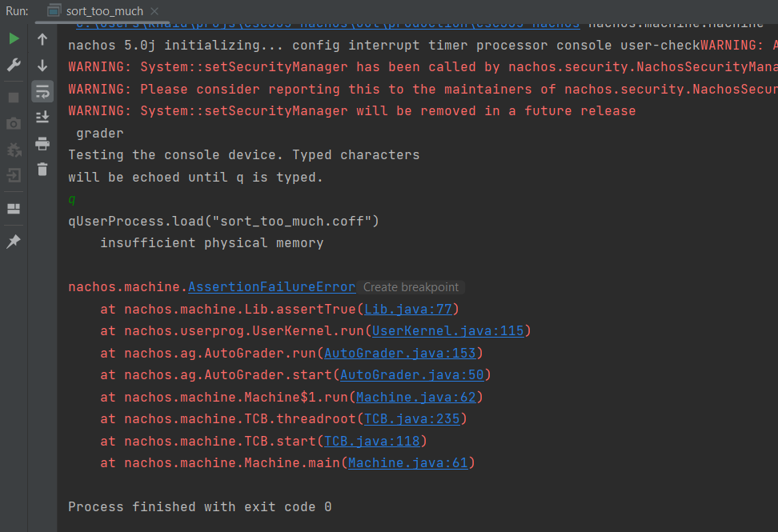
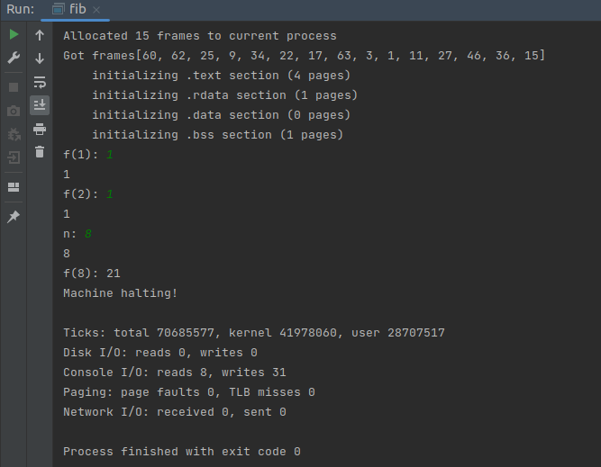

# Project 3

Name: Khai Dong

### Part 1: Gradescope

(See Gradescope)

### Part 2: Page it!

Here is the screenshot of `halt.coff` running in NACHOS.

### Part 3: System Calls
The screenshots of the working program are below
#### `power.coff`

#### `search_for_e.coff`

#### `sort_large.coff`

#### `sort_medium.coff`

#### `sort_small.coff`

#### `sort_too_much.coff`

#### `fib.coff`
This program prompts the first 2 numbers `f(1)` and `f(2)` of a Fibonacci sequence and an `n`, and compute the `f(n)`, 
the `n`th Fibonacci number. `n` can be as large as the max of unsigned int and will still give reasonable runtime, but 
too large of a number can't be stored in `int`.

The Fibonacci sequence up to the 8th number is `1 1 2 3 5 8 13 21`

